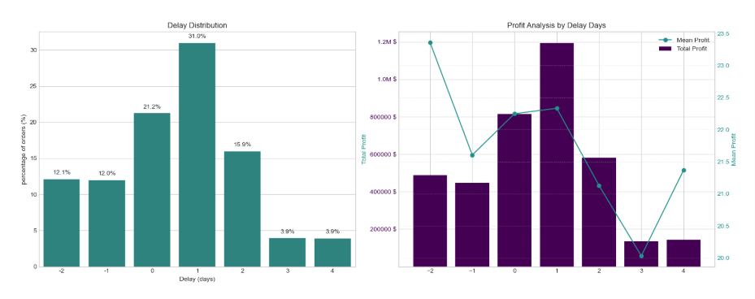
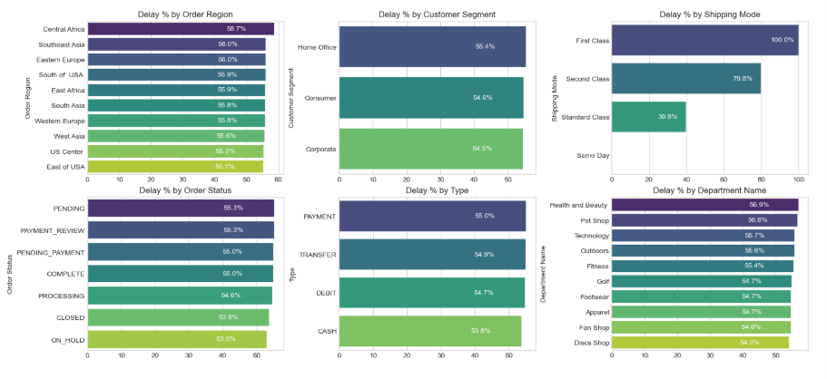
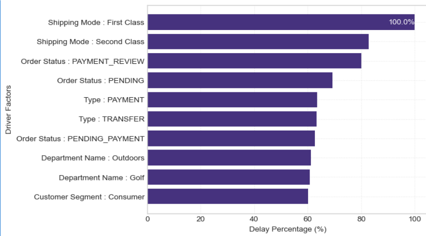

🚚 End-to-End Supply Chain Delivery & Predictive Analytics
Tech Stack: Python Scikit-Learn Pandas Matplotlib Seaborn SMOTE

This project analyzes global e-commerce order fulfillment to uncover delivery bottlenecks and quantify financial impact. Using Python, Pandas, and Scikit-Learn, it features a Random Forest classification model (balanced with SMOTE) that predicts chronic late shipments with 74% accuracy, enabling proactive supply chain interventions.

---

## 📌 Table of Contents
- [Overview](#overview)  
- [Business Problem](#business-problem)  
- [Dataset](#dataset)  
- [Tools & Technologies](#tools--technologies)  
- [Project Structure](#project-structure)  
- [Data Cleaning & Preparation](#data-cleaning--preparation)  
- [Exploratory Data Analysis (EDA)](#exploratory-data-analysis-eda)  
- [Machine Learning & Key Findings](#machine-learning--key-findings)  
- [How to Run This Project](#how-to-run-this-project)  
- [Future Enhancements](#future-enhancements)  
- [Author & Contact](#author--contact)  

---

## Overview
This project presents a comprehensive analysis of the delivery operations of a global e-commerce company, covering 172,765 orders from January 2015 through January 2018. The goal is to identify root causes of late deliveries, quantify the financial impact, and build a predictive model to flag high-risk orders before shipment.

---

## Business Problem
In the highly competitive e-commerce sector, late deliveries severely damage customer retention and erode margins. Executive teams need to understand:
- Why 54.71% of all orders are missing their promised delivery windows.
- The exact operational bottlenecks causing these failures (e.g., shipping modes, regions, or payment friction).
- How much profitability is at risk due to these delays.
- How to proactively identify an order that is likely to be late before it becomes a customer complaint.
This project aims to:
- Quantify the financial leakage (identifying $2.1M in at-risk profit).
- Pinpoint specific driver factors, such as the catastrophic 100% failure rate of "First Class" shipping.
- Deploy a supervised Machine Learning model to predict delivery delays with high precision.

---

## Dataset
- **Source:** DataCo Smart Supply Chain Dataset (172,765 records; Jan 2015 – Jan 2018).   
- **Core Granularity**: Order and item-level fulfillment data across global markets.

Key columns analyzed:
- `Days for shipping (real)` & `Days for shipment (scheduled)` – Core metrics used to calculate the exact `Delay`.
- `Order Profit Per Order` & `Sales` – Financial metrics to quantify margin erosion.
- `Shipping Mode`, `Customer Segment`, `Order Region` – Categorical drivers used to detect bottlenecks.
- `Order Status` & `Type` – Payment and processing tracking metrics.
- `Late_delivery_risk` – Binary target variable for the classification model.

---

## Tools & Technologies
- **Python** – Core programming language for data manipulation and modeling.
- **Pandas & NumPy** – Data extraction, cleaning, and feature engineering.
- **Matplotlib & Seaborn** – Data visualization, custom business-themed charting, and profitability distributions.
- **Skit-Learn** - Machine Learning pipeline (Random Forest Classifier, train/test splitting, performance metrics).
- **SMOTE (Imbalanced-Learn)** - Synthetic Minority Over-sampling Technique to balance the target variable classes.

---

## Project Structure
Suggested folder layout for this project:
```text
supply-chain-delivery-prediction-python-ml/
│
├── README.md                      # Project documentation
├── requirements.txt               # Python package dependencies
│
├── notebooks/
│   └── Supply_Chain_Analysis.ipynb # Main Jupyter Notebook with EDA & ML
│
├── reports/
│   └── SUPPLY_CHAIN_DELIVERY_PERFORMANCE_REPORT.pdf # Executive summary
│
└── dataset/                       
    └── DataCoSupplyChainDataset.csv # Raw data file (ensure ignored in .gitignore)
```

## Data Cleaning & Preparation
Main cleaning and feature engineering steps performed in Pandas:
- **Dimensionality Reduction**: Dropped 35 redundant or completely null columns (e.g., `Product Description`, `Customer Password`, irrelevant IDs) to optimize memory.
- **Data Filtering**: Removed "Shipping canceled" orders, as they skew true delivery-time metrics.
- **Date Parsing**: Standardized string dates to standard `datetime` objects for time-series extraction (Month, Day of Week, Hour of Day).
- **Feature Engineering**: Created the `Delay` feature (Real Shipping Days - Scheduled Shipping Days), an `Is_Delayed` boolean flag, and a categorical `Profitability Flag` (Profit, Loss, Break-even) using `np.where`.

---

## Exploratory Data Analysis (EDA)

The notebook explores the data through highly customized, business-ready Seaborn visualizations:

### 1. Profitability & Delay Distribution
Quantified that while 80.7% of orders are profitable, delayed orders trap **$2.1M** in vulnerable working capital. Identified that a 1-day delay is the most common operational failure (31%).



---

### 2. Operational Bottleneck Detection
Visualized delay percentages across 6 core operational categories. Uncovered that the delay rate is systemic globally, but specific departments (Outdoors, Golf) and payment statuses (`PAYMENT_REVIEW`) are severe choke points.



---

### 3. Temporal Demand Surges
Mapped delay rates by Month, Day, and Hour to prove that while daily delays are stable, promotional months (August, September, December) overwhelm warehouse capacity.



---

## Machine Learning & Key Findings

### Predictive Modeling
Engineered a **Random Forest Classifier** to predict the `Late_delivery_risk`.
- **Class Balancing:** Utilized **SMOTE** to balance the 59k on-time orders with the 79k late orders in the training set.
- **Performance:** Achieved a **74% Overall Accuracy** and a **0.78 Precision** score on identifying late orders, meaning the system is highly reliable when it triggers a "Late Risk" alert.

### Key Business Recommendations
- **Audit Premium Shipping:** "First Class" shipping failed 100% of the time, and "Second Class" failed 79.8% of the time. Recommended immediate renegotiation of carrier SLAs or defaulting to "Standard Class" (which performed significantly better).
- **Deploy Early Warning Alerts:** Integrate the Random Forest model into the OMS to alert warehouse staff of high-risk orders at checkout for priority pick-and-pack routing.
- **Fix Payment Friction:** Automate escalations for orders stuck in `PAYMENT_REVIEW` longer than 2 hours, as this status correlated with an 80% delay rate in key regions.

---

## How to Run This Project

1. **Set up the Database (Optional but recommended)**
   - Run the setup scripts in `sql_scripts/01_schema_setup.sql` to build the database.
   - Import the raw CSVs into your SQL environment.
2. **Execute Aggregations**
   - Run the views in `03_risk_aggregations.sql` to prepare the data for visualization.
3. **Open the Dashboard**
   - Open `Fleet_Risk_Command_Center.pbix` in Power BI Desktop.
   - If using local CSVs instead of SQL, ensure the file paths in Power Query Editor point to your local `dataset/` folder.
4. **Interact with the Data**
   - Use the Slicers (e.g., Risk Sensitivity > 30%) to watch the visual heatmaps filter the 86k data points down to critical actionable insights.

---

## Future Enhancements
- Upgrade the predictive engine to `XGBoost` or `LightGBM` to push recall and precision above 85%.
- Build a real-time `Streamlit` or `Gradio App` where users can input order parameters and instantly receive a delivery risk score.
- Incorporate external factors (e.g., historical weather data or holiday calendars) to improve seasonal delay predictions.

---

## Author & Contact

**Ahmad Reza**  
*Aspiring Data Analyst – ML*  

- 📧 Email: ahmadreza6122@gmail.com  
- 🔗 LinkedIn: [[www.linkedin.com/in/ahmad-reza-econ](https://www.linkedin.com/in/ahmad-reza-econ)] 
- 🔗 GitHub:

***
